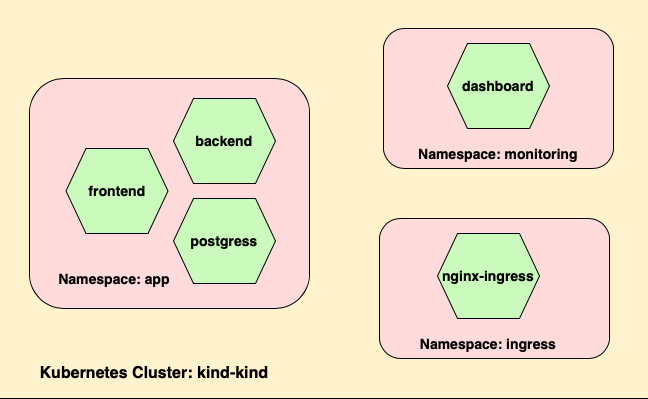

# Helm Learning Project
This repo contains a helm chart created as a part of learning Docker Helm.

Here is a diagram describing the system:




## Application Folder Structure
```
────app
    │   .helmignore
    │   Chart.yaml
    │   values.yaml
    │
    ├───charts
    └───templates
        │   deployment.yaml
        │   hpa.yaml
        │   ingress.yaml
        │   NOTES.txt
        │   service.yaml
        │   serviceaccount.yaml
        │   _helpers.tpl
        │
        └───tests
                test-connection.yaml
```

* `.helmignore` - This file is used to identify which files which should be
  ignored when packaging the Helm chart.
* `Chart.yaml` - Holds the name, author, version, and depencies of the Chart.
* `values.yaml` - Holds the default configuration for the chart.
* `/charts` - Directory in which other charts will be located upon which this
  chart is dependent. 
* `/templates` - contains the Helm template files which are the blueprints for
  Kubernetes resources with supporting files. 
* `templates/tests` - contains the tests which verify if the installation ends
  with a success.

## Setup / Installation Steps
1. Clone repo. 
2. Add Helm repository: 
`helm repo add bitnami https://charts.bitnami.com/bitnami`
3. Create `postgres` release: 
`helm upgrade postgres bitnami/postgresql -n kanban --create-namespace --install --values postgres.yaml --version 12.1.6`
4. Confirm it successfully installs: 
`kubectl get pods -n kanban`
5. Create Backend: 
`helm upgrade kanban-backend ./app -n kanban --create-namespace --install --values kanban-backend.yaml`
6. Confirm it successfully installs: 
`kubectl get pods -n kanban`
7. Install Front end: 
`helm upgrade kanban-frontend ./app -n kanban --create-namespace --install --values kanban-frontend.yaml`
8. Confirm it successfully installs: 
`kubectl get pods -n kanban`

### Front End Access
1. Forward a port to access front end via a browser. 
`kubectl port-forward svc/kanban-frontend 8081:8080 -n kanban`

2. Access Front end at [http://localhost:8081](http://localhost:8081).

### Running tests
1. Make your changes to the templates. Save them, then upload them with a
   command like: 
`helm upgrade kanban-frontend ./app -n kanban --wait --values kanban-frontend.yaml`
2. Execute the tests with a command like: 
`helm test kanban-frontend --namespace kanban`
or if you want detailed logs:
`helm test kanban-frontend --logs --namespace kanban`

## Reference
This basic application was taken from Github user `wkrzywiec/kanban-board`
